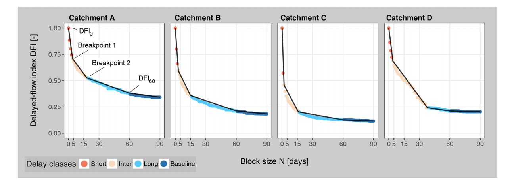

# delayedflow

`delayedflow` is developed to make it quick and easy to perform a delayed flow separation with streamflow data. The package is based on the publication from  [Stoelzle et al. (2020)](https://hess.copernicus.org/articles/24/849/2020/) where common binary baseflow separation into quick- and baseflow is advanced by the DFI (Delayed Flow Index) to quantify multiple delayed contributions to streamflow.

As in hydrology different sources (e.g. like storm flow, interflow, snow or glacier melt, groundwater) shape the catchments' hydrographs the DFI method considers specifically the specific streamflow contributions in each catchment. Therefore the hydrograph (streamflow signal) is deconvoluted based on a Characteristic Delay Curve (CDC).

To gain a CDC multiple streamflow separations are performed to quantify how much faster and how much slower streamflow contributions shape the hydrograph. Instead of having one separation (as for the common BFI, BaseFlow Index) `delayedflow` performs `n` separations and created the CDC out of them. Then a breakpoint analysis (`find_bp`) transforms the normally expotential falling CDC into piecewise linear segments where in between the breakpoints indicating that a faster source stops to contribute to streamflow and a slower source gets more dominate.

The figure below shows four examples of CDCs in four different catchments and how the breakpoints are used to identify different delayed contributions.




### 1. Introduction

cooming soon

### 2. Package installation

The `delayedflow` package is in beta testing now. It is not available via CRAN yet.

```{R}
# ----- use package in R  -----
#install.packages("devtools")
devtools::install_github("modche/delayedflow")
```

### 3. Vignette / Manual

Go to https://modche.github.io/delayedflow/

### 3. Reporting issues

Please report any issue you have with the package on
https://github.com/modche/delayedflow/issues

### 4. References

Stoelzle, M., Schuetz, T., Weiler, M., Stahl, K., & Tallaksen, L. M. (2020). Beyond binary baseflow separation: a delayed-flow index for multiple streamflow contributions. Hydrology and Earth System Sciences, 24(2), 849-867, https://hess.copernicus.org/articles/24/849/2020/.
